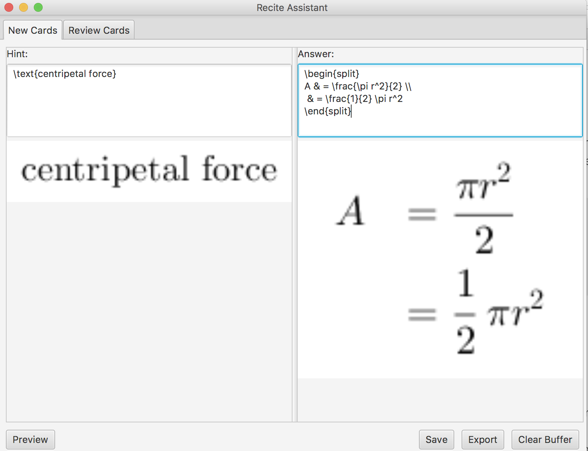
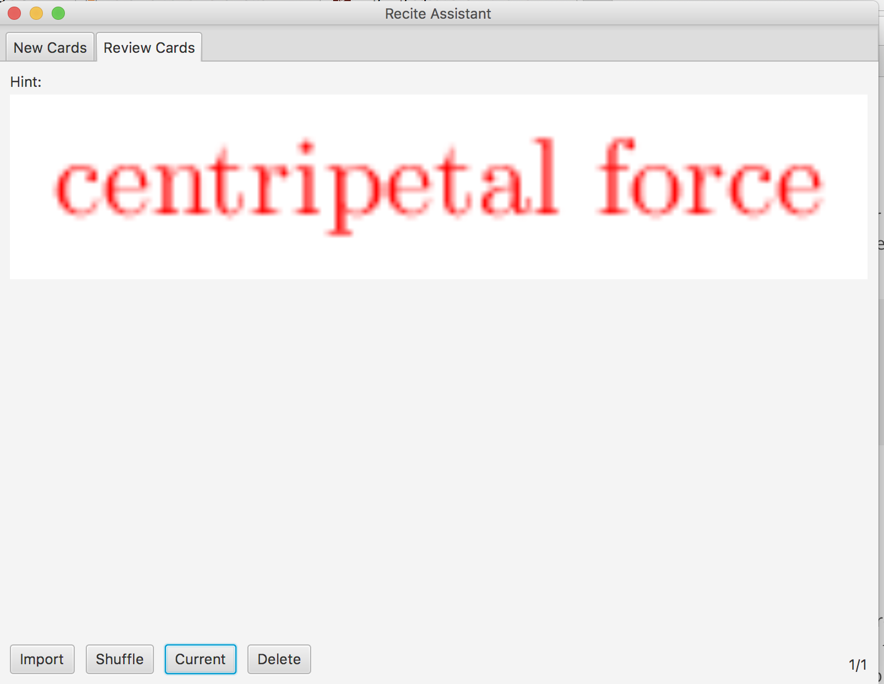

# ReciteAssistant
Latex-ed Flashcards. IntelliJ JavaFX Project.

## Add New Card

## Review and Mark Cards

## Keys:
A - Previous card

D - Next card

J - Check answer

K - Mark card

U - Unmark card